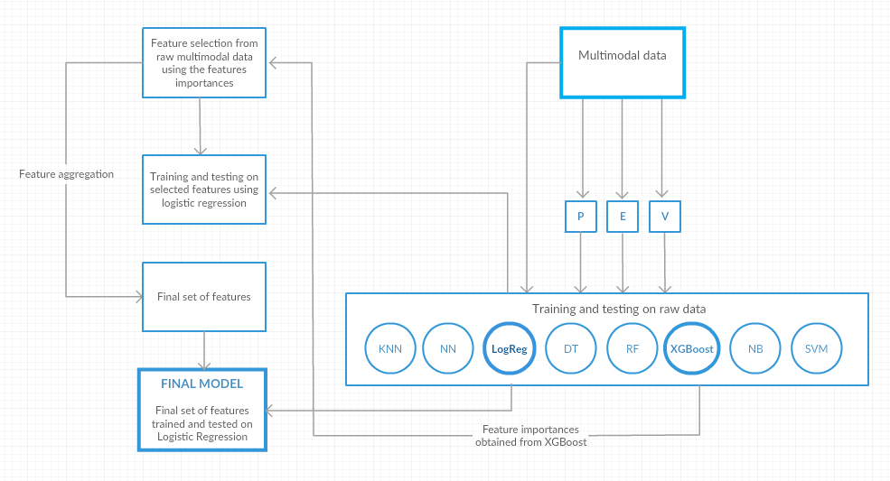

# Drowsy Driver Detection

## About the project
Drowsiness during driving is a major cause of safety for drivers and its detection is one topic that intelligent transport systems deal with. We took dataset from Kaggle on drowsy driving, which consisted of features from three modalities, namely Physiological (P), Environmental (E) and Vehicular (V).

Our aim was to develop a model which was able to differentiate *drowsy state* and *alert state* of a driver effectively, and also to find which modality or combination of modalities best described the state of the driver. We came up with a simple model of *Logistic regression* based on sequential feature selection using *ensemble trees* and feature generation by aggregating similar instances present in the dataset.

Our results displayed high alertness detection rates and also helped establish which modalities contributed most to detection of state of the driver.

## The dataset
The dataset is present on Kaggle and was provided by Ford for it's "Stay Alert! The Ford Challenge". The dataset can be found [here](https://www.kaggle.com/c/stayalert#description).

## Workflow
Our proposed model consists of a series of steps, which can be seen in the figure below:

### Our research paper for this project has been selected at [ISDA 2017](http://www.mirlabs.net/isda17/) and shall be duly published
